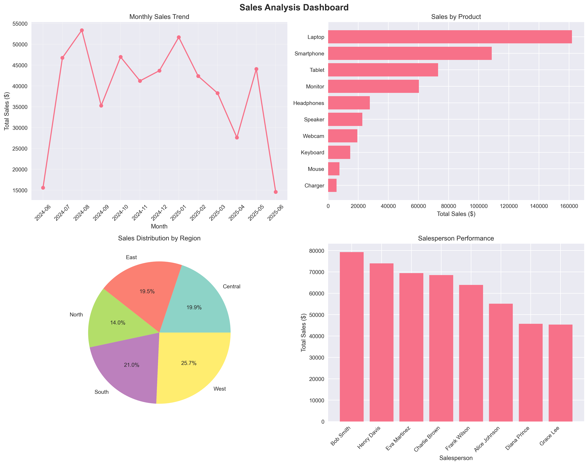
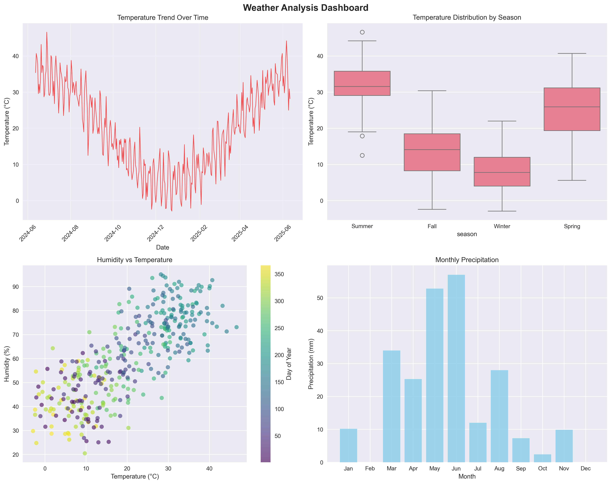
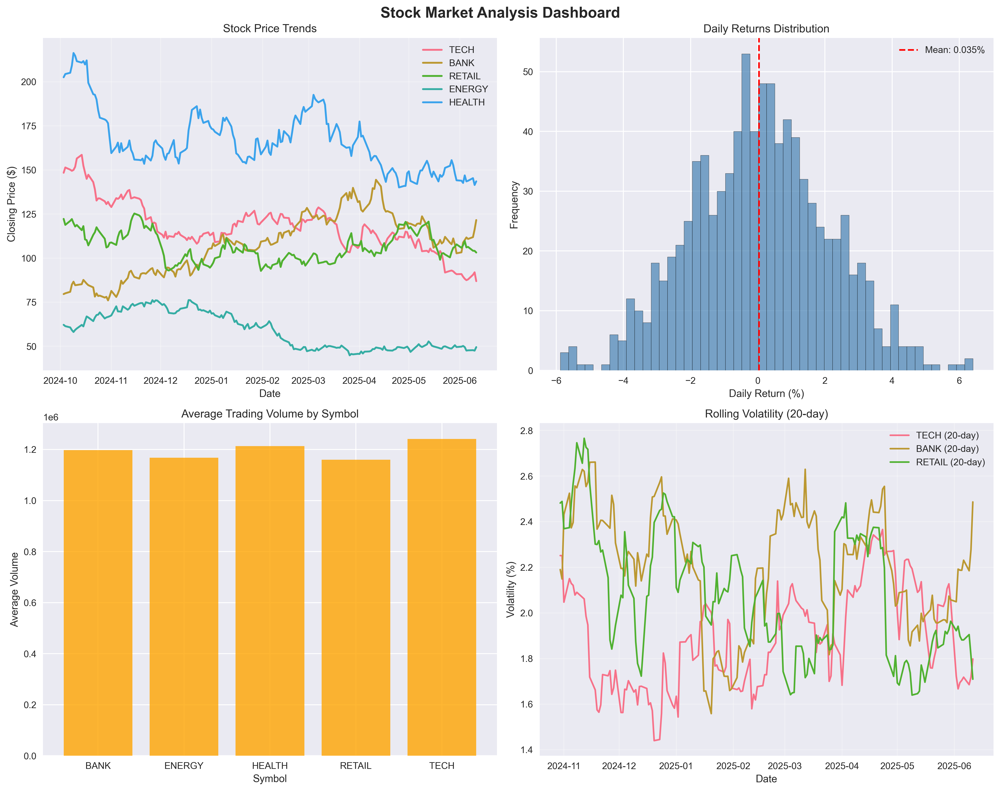
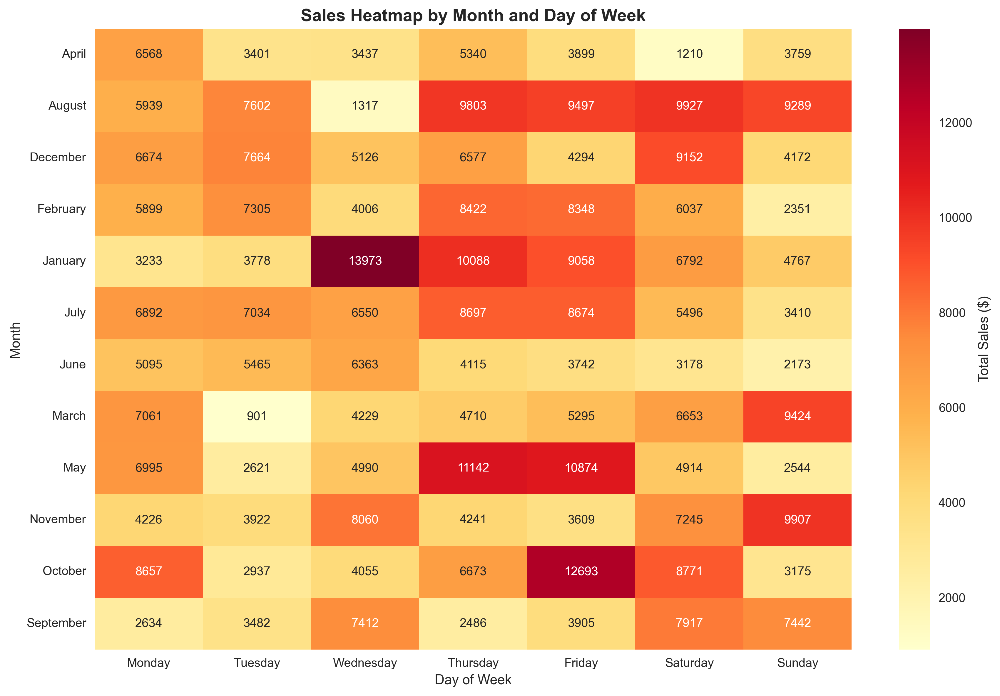

# Data Generation & Visualization Project

A comprehensive Python project that generates synthetic datasets, stores them in various formats (CSV, JSON), and creates both static and interactive visualizations using matplotlib and plotly.

## 🚀 Features

- **Data Generation**: Creates realistic synthetic datasets for:
  - Sales data with seasonal trends
  - Weather data with natural patterns  
  - Stock market data with volatility
  - Customer demographics and behavior

- **Data Storage**: Supports multiple formats:
  - CSV files for tabular data
  - JSON files for structured data
  - Excel files for multi-sheet data
  - Automated backup functionality

- **Visualizations**: Creates both static and interactive plots:
  - Static plots using matplotlib and seaborn
  - Interactive dashboards using plotly
  - Comprehensive analysis dashboards
  - Export to PNG and HTML formats

## 📦 Installation

This project uses [uv](https://github.com/astral-sh/uv) for dependency management.

```bash
# Clone the repository
git clone <your-repo-url>
cd uv_package_demo

# Install dependencies with uv
uv sync
```

## 🎯 Usage

Run the main script to generate data and create visualizations:

```bash
uv run python main.py
```

This will:
1. Generate sample datasets (sales, weather, stock, customer data)
2. Save data in both CSV and JSON formats in the `Data/` folder
3. Create static visualization plots
4. Generate an interactive HTML dashboard

## 📁 Project Structure

```
uv_package_demo/
├── main.py                 # Main execution script
├── data_generator.py       # Data generation module
├── data_storage.py         # Data storage and loading utilities
├── visualizer.py           # Visualization creation module
├── Data/                   # Generated data files
│   ├── sales_data.csv
│   ├── weather_data.json
│   ├── stock_data.csv
│   └── customer_data.json
├── plots/                  # Generated visualization files
│   ├── sales_analysis.png
│   ├── weather_analysis.png
│   ├── stock_analysis.png
│   ├── sales_heatmap.png
│   └── interactive_dashboard.html
├── pyproject.toml          # Project dependencies
└── README.md              # This file
```

## 📊 Generated Datasets

### Sales Data
- Date, product, quantity, pricing
- Regional and salesperson information
- Seasonal trends and patterns
- Customer IDs for relationship tracking

### Weather Data  
- Daily temperature, humidity, pressure
- Wind speed and precipitation
- Seasonal variations
- Day of year and month categorization

### Stock Data
- OHLCV (Open, High, Low, Close, Volume) data
- Multiple company symbols
- Daily returns and volatility metrics
- Realistic market simulation

### Customer Data
- Demographics (age, location, occupation)
- Financial information (income, spending)
- Behavioral metrics (loyalty, preferences)
- Purchase history and engagement

## 📈 Visualizations

### Sample Generated Plots

<table>
  <tr>
    <td align="center">
      
      <br><b>Sales Analysis Dashboard</b>
      <br>Monthly trends, product performance, regional distribution
    </td>
    <td align="center">
      
      <br><b>Weather Analysis Dashboard</b>
      <br>Temperature trends, seasonal patterns, correlation plots
    </td>
  </tr>
  <tr>
    <td align="center">
      
      <br><b>Stock Market Analysis</b>
      <br>Price movements, returns distribution, volatility analysis
    </td>
    <td align="center">
      
      <br><b>Sales Heatmap</b>
      <br>Sales patterns by day of week and month
    </td>
  </tr>
</table>

### Static Plots (matplotlib/seaborn)
- **Sales Analysis**: Monthly trends, product performance, regional distribution
- **Weather Analysis**: Temperature trends, seasonal patterns, correlation plots
- **Stock Analysis**: Price movements, returns distribution, volatility analysis
- **Heatmaps**: Sales patterns by time periods

### Interactive Dashboard (plotly)
- Multi-panel dashboard with all data types
- Zoom, pan, and hover functionality
- Responsive design for web viewing
- Export capabilities for presentations

> 📊 **View the Interactive Dashboard**: Open [`plots/interactive_dashboard.html`](plots/interactive_dashboard.html) in your browser to explore the interactive visualizations with hover effects, zooming, and filtering capabilities.
- Export capabilities for presentations

## 🛠️ Modules

### DataGenerator
Generates realistic synthetic data with:
- Configurable sample sizes
- Realistic distributions and correlations
- Seasonal and trend patterns
- Reproducible results with random seeds

### DataStorage
Handles data persistence with:
- Multiple format support (CSV, JSON, Excel)
- File management utilities
- Backup and restore functionality
- Data summary and statistics

### Visualizer
Creates comprehensive visualizations:
- Static plots with matplotlib/seaborn
- Interactive plots with plotly
- Multi-panel dashboards
- Professional styling and formatting

## 🔧 Dependencies

- **pandas**: Data manipulation and analysis
- **numpy**: Numerical computing
- **matplotlib**: Static plotting
- **seaborn**: Statistical visualization
- **plotly**: Interactive plotting
- **rich**: Enhanced console output
- **streamlit**: Web app framework (optional)

## 🚀 Extending the Project

You can easily extend this project by:

1. **Adding new data types**: Create new generation methods in `DataGenerator`
2. **New visualization types**: Add methods to `Visualizer` class  
3. **Different storage formats**: Extend `DataStorage` with new formats
4. **Real-time data**: Integrate with APIs for live data feeds
5. **Machine learning**: Add predictive modeling capabilities

## 📝 Examples

### Generate Custom Data
```python
from data_generator import DataGenerator

generator = DataGenerator(seed=123)
custom_sales = generator.generate_sales_data(5000)
```

### Create Specific Visualizations
```python
from visualizer import Visualizer

viz = Visualizer()
viz.create_sales_analysis(sales_data)
viz.create_interactive_dashboard(sales_data, weather_data, stock_data)
```

### Handle Data Storage
```python
from data_storage import DataStorage

storage = DataStorage()
storage.save_to_excel({'sales': sales_data, 'weather': weather_data}, 'combined_data.xlsx')
```

## 🤝 Contributing

1. Fork the repository
2. Create a feature branch
3. Make your changes
4. Add tests if applicable
5. Submit a pull request

## 📄 License

This project is licensed under the MIT License - see the LICENSE file for details.

## 🙏 Acknowledgments

- Built with [uv](https://github.com/astral-sh/uv) for fast Python package management
- Uses industry-standard libraries for data science and visualization
- Inspired by real-world data analysis workflows